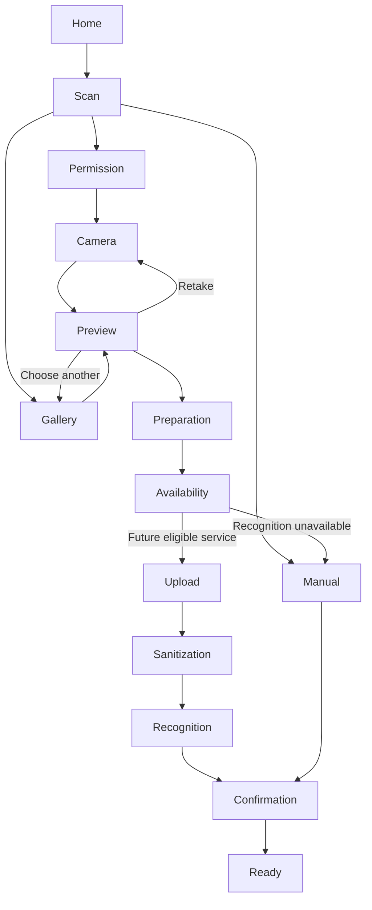

# Scan UX contract review — Phase A

Status: contract review complete; screens and device/user validation are not implemented. Uses the approved DESIGN.md / UX_FOUNDATION.md direction and existing semantic tokens. Home, Recipes, Saved, Community and Profile remain unchanged destinations.

## Flow



Recognition is unavailable in this milestone. The required copy is:

> Photo recognition isn’t available yet. Add your ingredients to continue.

The notice appears before authorizing/uploading a real household photo. It leads to an empty **Your ingredients** editor for a new draft, preserving any ingredients the user has already entered. There is no fake processing animation, fake ingredient list, indefinite queue, or AI-generated success. Actual sanitizer fixtures are exercised by command-line research tools, not a developer/debug screen inside the product.

## Reviewed scenarios

| Scenario | Surface and action | Data/focus contract |
| --- | --- | --- |
| First camera use | Short purpose explanation, then native request at point of use | Home itself requests no permission or anonymous identity. |
| Permission denied | Camera access is off; Try again if requestable, Choose photo, Enter manually | Do not repeat native prompts automatically. Focus recovery message once. |
| Permanently denied/restricted | Open settings plus gallery/manual alternatives | Recheck on return; do not represent Settings opening as permission success. |
| Camera unavailable | Specific camera-unavailable message and alternatives | Preserve a previous draft; no indefinite black viewport. |
| Gallery cancelled | Return to previous entry/camera/preview | Preserve existing preview; cancellation is not an error. Restore focus to Choose photo. |
| Gallery asset unavailable/cloud download fails | Explain inability to open photo; choose another or manual | Readiness/loading has a cancellation path; no upload yet. |
| Preview | Full image, Use photo, Retake, Choose another, Enter manually | Contain-fit preview shows what will be processed. Delete only obsolete app-owned files. |
| Preparing | Real stage text, interruptible progress | Duplicate Use photo taps cannot launch competing revisions. |
| Offline before upload | Capture/preview/manual editing stay usable; continuation waits for connection | Returning online does not automatically upload a never-submitted photo. |
| Offline after acceptance | Last known stage with connection notice | Server work may continue. Resume fetches status; it does not create another job. |
| Corrupt/unsupported/too-large image | Plain failure and another-photo/manual actions | Do not expose decoder errors, paths or metadata. |
| Recognition unavailable | Exact notice above; Add ingredients | No photo upload, fabricated detections or scan-quota debit. |
| Future zero detections/abstention | No ingredients were identified; Add ingredients or try another photo | Empty editor remains functional. Do not claim the photo contained no food with certainty. |
| Correction | Checkbox selection, Edit, Remove/Undo, Add ingredient | Preserve meaningful variants; corrections invalidate inappropriate canonical IDs. |
| Draft save fails | Inline retry; edits stay visible | Do not replace the editor with a blank loading screen. |
| Conflict on save | Explain newer saved revision; review/reconcile | Do not silently overwrite local edits or another device's confirmation. |
| Cancellation before server work | Discard actual photo/draft only after clear intent | No confirmation modal for closing an untouched camera. |
| Cancellation after acceptance/offline | Cancellation pending until acknowledged | Fence local callbacks immediately; never promise server/provider work already stopped. |
| Manual-only completion | Add/select/correct → Confirm ingredients → Ready | Ready requires acknowledged explicit confirmation, not a local optimistic flag. |
| Background/resume | Release camera/torch, stop unnecessary polling, restore draft and reconcile server | Never auto-capture on resume or turn backgrounding into cancellation. |
| Ready | Confirmed summary, Edit ingredients, Done | Recipe search is unavailable; do not present a working Find recipes action or create a recipe request. |

## Low-fidelity surfaces

```text
Scan ingredients           Review photo                Your ingredients
[camera viewport]          [whole selected photo]      [ ] User-entered name
Keep ingredients in view.  Keep personal details        Edit / Remove
                          out of the photo.            + Add ingredient
[Choose photo] [Shutter]   [Use photo]                  Selected count
[Enter manually]          [Retake] [Choose another]    [Confirm ingredients]
```

No example ingredient is seeded into the application. Future actual detections use **Detected ingredients**, a short reminder to review suggestions, and likely/uncertain labels. Likely items may start selected; uncertain items start unselected. AI output never implies guaranteed correctness. Manual rows have manual provenance and no invented certainty label.

## Accessibility and visual acceptance

- Reuse system typography, light/dark semantic colors, the current accessible action green, 4/8dp spacing, 6/8dp radii, and Lucide/system icons. No unrelated tab redesign.
- Food photo and readable ingredient names lead. Technical IDs, provider names, object paths and error internals do not enter product copy.
- Keep 48-unit minimum targets and 8dp control separation; labels wrap at large text sizes. Make camera controls readable against any scene using measured scrim/control surfaces.
- Accessible names announce shutter, camera direction and flash state; no gesture-only controls. Selected ingredient rows expose checkbox state, with separate Edit/Remove actions.
- Move focus to new screen headings and back to the edited row after editor dismissal. After removal choose the next sensible row or Add ingredient; Undo remains accessible.
- Announce errors once and progress stage changes politely. No repeated focus movement or announcements for every status poll.
- Support keyboard insets, visible Save/Cancel, safe-area bottom actions, reduced motion and both orientations supported by existing configuration.
- “Offline” does not replace all locally usable content. Preserve visible drafts and communicate pending sync accurately.

The installed UI/UX guidance was queried for error recovery and React Native keyboard handling. Its recovery and keyboard recommendations fit this flow. No new palette, typography family, or marketing-style layout was adopted.

## Evidence classification

- **PROVEN LOCALLY:** executable contract tests preserve manual flow, stale-result suppression, explicit confirmation, permission readiness and offline/cancellation semantics.
- **ASSUMED:** the proposed layout and wording will be understandable in a real kitchen; no usability result is claimed.
- **DEFERRED:** clickable core-flow prototype, 5–8 representative adults, TalkBack/VoiceOver, largest text, physical camera/gallery, glare, one-handed use, Android activity restoration and iOS testing. These existing Phase 0/native gates remain open.
- **REQUIRES OWNER DECISION:** none for the approved visual direction or manual fallback. Real-user processing disclosures still depend on final legal/privacy and processor decisions.


## Resume review findings

- Unknown connectivity must allow an authorized network attempt; only a known offline signal blocks starting the upload. Actual failures determine recovery. The state specification now matches the existing connectivity foundation.
- Confirmation requires an explicit action and a newer acknowledged server version. A saved acknowledgement arriving after a connectivity change remains valid; unsaved local edits never claim success.
- Availability is checked before upload authorization. Existing queued/running status stays readable if the provider later becomes unavailable. Manual fallback preserves edits and fences late recognition.
- Oversized source images get “Choose a smaller photo or enter ingredients manually.” The owner provisionally approved the 12 MP full-decode ceiling as an engineering safety limit, not a permanent product requirement. Physical Android/device tests may justify raising it with proven bounded downsampling; high-resolution/HEIC conversion must be proven on devices before promising support. Very narrow panoramas that would resize below 256 px on one axis are unsupported; never silently crop or upscale them.
- Camera/gallery cancellation returns to the previous usable surface. Confirmed ingredients reach a summary with Edit/Done; no recipe action is enabled in this scope.

Review queries rerun during resumption: `error recovery preserve input` in the UX domain matched Error Recovery; `keyboard avoiding safe area` in the React Native stack matched keyboard handling. These support the existing recovery and keyboard criteria. This was a document/contract review, not an installed mobile interface or usability session.
